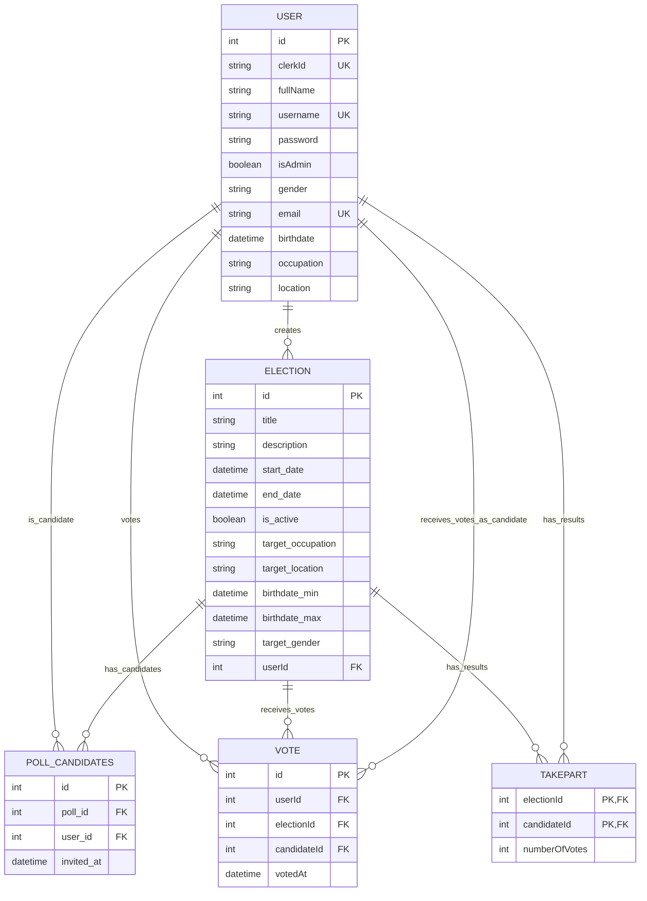
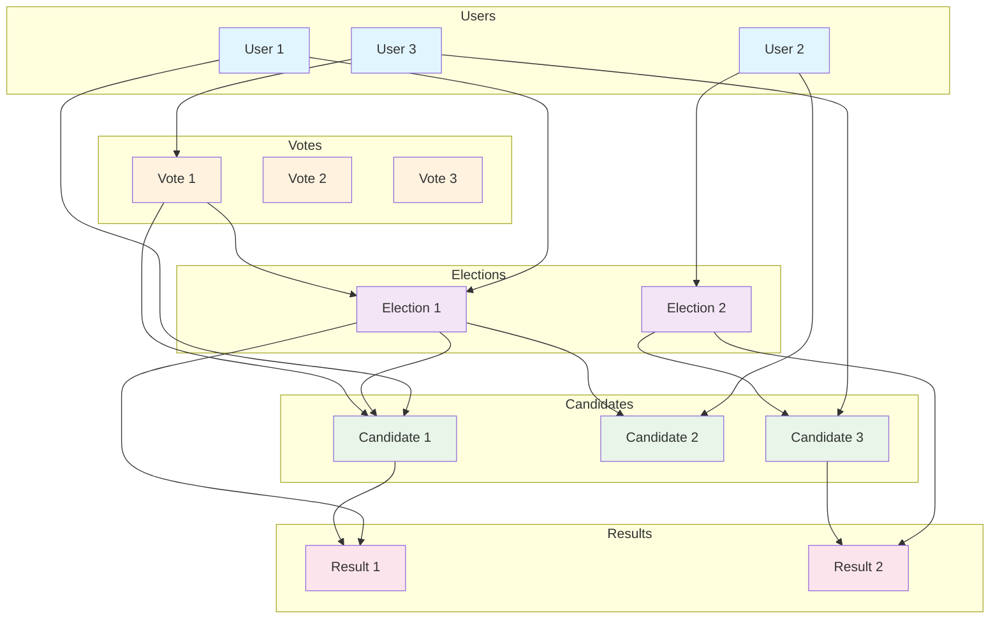

# Διάγραμμα ER - Voting System

## Entity-Relationship Diagram

## Επεξήγηση Διαγράμματος

### Κύριες Οντότητες (Entities)

1. **USER** - Χρήστες του συστήματος
   - Περιλαμβάνει όλες τις πληροφορίες χρήστη
   - Μπορεί να είναι admin, ψηφοφόρος, ή υποψήφιος

2. **ELECTION** - Ψηφοφορίες
   - Περιλαμβάνει όλες τις πληροφορίες ψηφοφορίας
   - Συνδέεται με τον δημιουργό της (userId)

3. **POLL_CANDIDATES** - Υποψήφιοι σε ψηφοφορίες
   - Junction table μεταξύ USER και ELECTION
   - Καταγράφει ποιοι χρήστες είναι υποψήφιοι σε ποιες ψηφοφορίες

4. **VOTE** - Ψήφοι
   - Καταγράφει τις ψήφους των χρηστών
   - Συνδέει ψηφοφόρο, ψηφοφορία και υποψήφιο

5. **TAKEPART** - Αποτελέσματα ψηφοφοριών
   - Καταγράφει τα τελικά αποτελέσματα
   - Composite primary key (electionId, candidateId)

### Συσχετίσεις (Relationships)

- **USER ||--o{ ELECTION**: Ένας χρήστης μπορεί να δημιουργήσει πολλές ψηφοφορίες
- **USER ||--o{ POLL_CANDIDATES**: Ένας χρήστης μπορεί να είναι υποψήφιος σε πολλές ψηφοφορίες
- **ELECTION ||--o{ POLL_CANDIDATES**: Μία ψηφοφορία μπορεί να έχει πολλούς υποψήφιους
- **USER ||--o{ VOTE**: Ένας χρήστης μπορεί να ψηφίσει πολλές φορές (σε διαφορετικές ψηφοφορίες)
- **ELECTION ||--o{ VOTE**: Μία ψηφοφορία μπορεί να λάβει πολλές ψήφους
- **USER ||--o{ VOTE**: Ένας χρήστης μπορεί να λάβει πολλές ψήφους ως υποψήφιος
- **ELECTION ||--o{ TAKEPART**: Μία ψηφοφορία έχει πολλά αποτελέσματα
- **USER ||--o{ TAKEPART**: Ένας χρήστης μπορεί να έχει πολλά αποτελέσματα

### Σημαντικά Χαρακτηριστικά

1. **Περιορισμοί Ψήφου**: `@@unique([userId, electionId])` - Κάθε χρήστης μόνο μία ψήφο ανά ψηφοφορία
2. **Cascade Deletes**: Όταν διαγράφεται ψηφοφορία, διαγράφονται αυτόματα υποψήφιοι και ψήφοι
3. **Composite Keys**: Το TAKEPART έχει composite primary key για αποφυγή διπλών εγγραφών
4. **Multiple Relations**: Ο USER έχει πολλαπλές σχέσεις με το VOTE για διαφορετικούς ρόλους

## Εναλλακτική Προβολή - Σχηματικό Διάγραμμα

## Σύνοψη Συσχετίσεων

| Συσχέτιση | Τύπος | Περιγραφή |
|-----------|-------|-----------|
| USER - ELECTION | 1:N | Χρήστης δημιουργεί πολλές ψηφοφορίες |
| USER - POLL_CANDIDATES | 1:N | Χρήστης είναι υποψήφιος σε πολλές ψηφοφορίες |
| ELECTION - POLL_CANDIDATES | 1:N | Ψηφοφορία έχει πολλούς υποψήφιους |
| USER - VOTE | 1:N | Χρήστης ψηφίζει πολλές φορές |
| ELECTION - VOTE | 1:N | Ψηφοφορία λαμβάνει πολλές ψήφους |
| USER - VOTE (candidate) | 1:N | Χρήστης λαμβάνει πολλές ψήφους ως υποψήφιος |
| ELECTION - TAKEPART | 1:N | Ψηφοφορία έχει πολλά αποτελέσματα |
| USER - TAKEPART | 1:N | Χρήστης έχει πολλά αποτελέσματα |
